# 基于物体轮廓检测和特征提取的木材图像计数模型

​	**模型解决问题：使用计算机算法来处理木材照片，从照片中直接计算得知木	材的数量。**

#### 	一.运行环境配置

1. python==3.6
2. Opencv== 3.4.2.16 (这里注意SIFT算法已经申请专利，高版本的该算法已经移除)
3. matplotlib==3.1.1
4. .....

具体详细库信息配置见requirements.txt.

可以使用下面命令直接配置相关环境。

```python
pip install -r requirements.txt
```

如果执行上面pip指令失败，可以考虑正常安装opencv类库，然后执行以下代码：

```python
pip uninstall opencv-python
#推荐使用豆瓣python源
pip install opencv-python==3.4.2.16 -i "https://pypi.doubanio.com/simple/"
pip install opencv-contrib-python==3.4.2.16 -i "https://pypi.doubanio.com/simple/"
```

对于如果执行程序出现

AttributeError: module 'cv2.cv2' has no attribute 'xfeatures2d'之类因为算法是否开源的问题，可以从新执行以下代码

```python
pip uninstall opencv-python
#推荐使用豆瓣python源
pip install opencv-python==3.4.2.16 -i "https://pypi.doubanio.com/simple/"
pip install opencv-contrib-python==3.4.2.16 -i "https://pypi.doubanio.com/simple/"
```

#### 二.程序整体代码说明

本程序分为两部分：

1. **模型一**基于环境对计数影响不大其检测目标较为清晰辨别的图片进行木材计数模型如下图：

   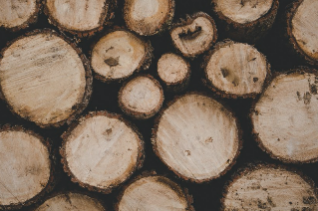

   具体代码见other_image文件中的代码。这个主要的代码为main.py文件，其他的为辅助文件，用于探索和评价相关的方法是否适合。

2. **模型二**基于环境（光照）对影响计数较大且辨别较难的图片进行木材计数模型如下图：

   

   具体代码见first_iamge文件中的first_image.py,第二个模型实现了有关的自动化脚本的功能。

#### 三. 模型一

处理原图如下：


预处理流程图如下：


预处理后得到图像如下：

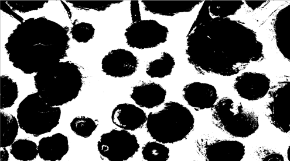

对图像进行SIFT算法处理得到结果图如下：

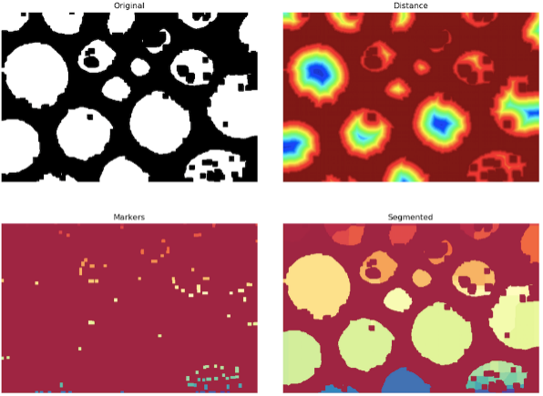

使用联通法对木材图片中的木材进行计数效果图如下：

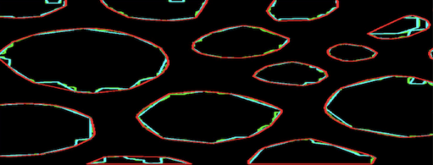

具体详细代码可以参考other_image文件夹中的如下文件：

counter_sticks.py 、edge_cutting.py、last_test.py、main.py、test2.py、test4.py、分水岭.py

#### 四. 模型二

处理原图为：


预处理流程图如下：


​                                     

灰度化图

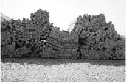

闭运算预处理      

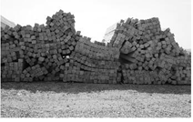

开运算预处理

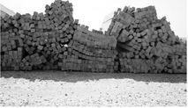

梯度运算预处理

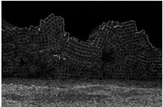

顶帽运算

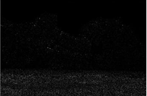

黑帽运算

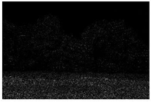

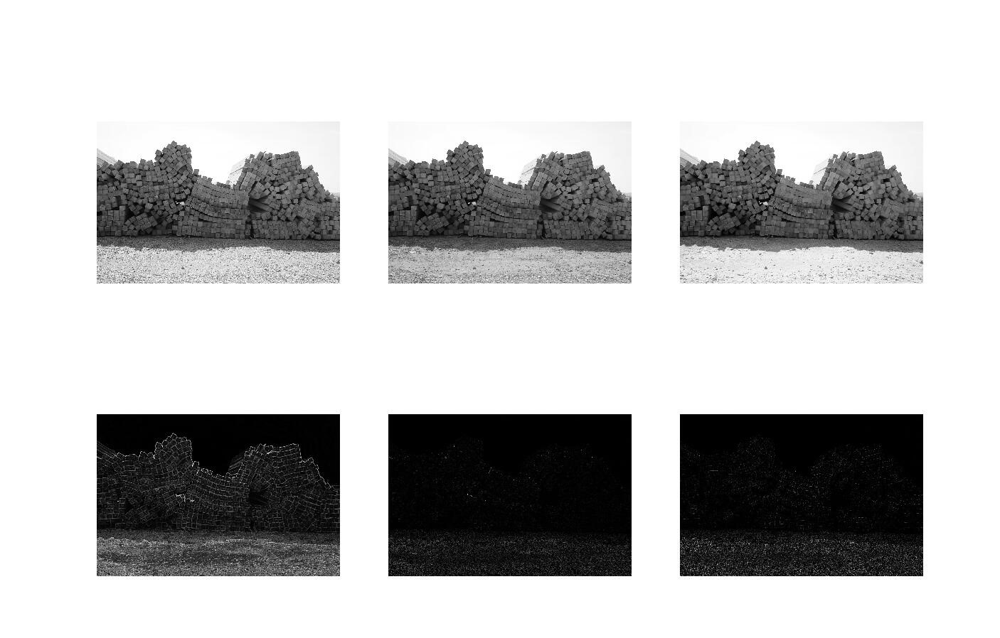

该部分程序的主要思想：使用图像分割，以及图像边缘检测、和图像进行特征点匹配算法。

边缘增强图像如下：

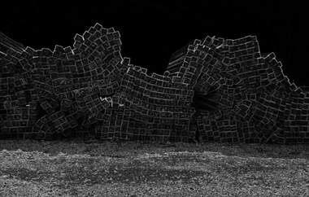

沙子边缘检测结果  

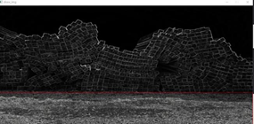

去除沙子影响的灰度图

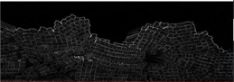

进行图像分割后的边缘检测算法结果图：

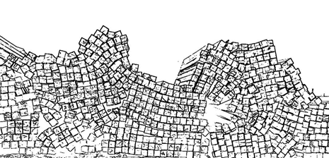

最后通过特征点匹配进行木材计数功能。

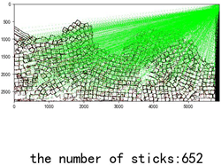


